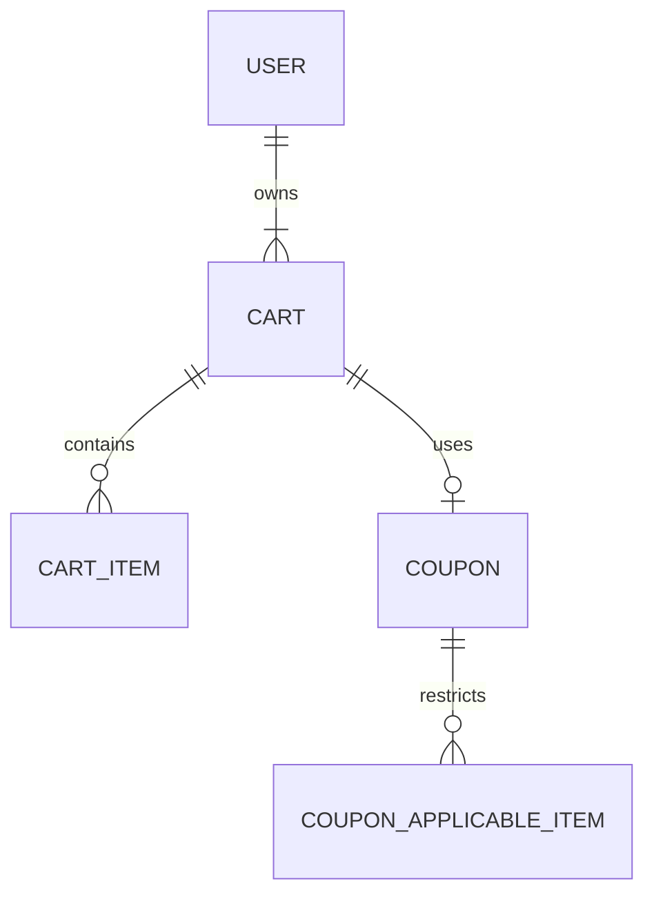

# Low-Level Design (LLD) for SCRUM-11693: Apply/Remove Coupon in Cart (SpringBoot Backend)

---

## 1. Objective
This LLD describes the technical implementation for the feature: "As a shopper, I want to apply or remove a coupon in my cart, so that I can avail discounts on my purchase." The solution enables users to apply and remove coupons in their cart via RESTful APIs, updating the cart total instantly and ensuring accurate validation and secure processing. All requirements for logged-in and guest users, validation, and performance are addressed in a scalable SpringBoot design.

---

## 2. SpringBoot Backend Details

### 2.1. Controller Layer

#### 2.1.1. REST API Endpoints
| Operation         | REST Method | URL                          | Request Body                        | Response Body           |
|-------------------|-------------|------------------------------|-------------------------------------|------------------------|
| Apply Coupon      | POST        | /api/cart/{cartId}/coupon    | { "couponCode": "STRING" }         | CartResponse           |
| Remove Coupon     | DELETE      | /api/cart/{cartId}/coupon    | -                                   | CartResponse           |
| Validate Coupon   | POST        | /api/coupon/validate         | { "couponCode": "STRING", "cartId": "STRING" } | CouponValidationResult |

#### 2.1.2. Controller Classes
| Class Name               | Responsibility                               | Methods                         |
|-------------------------|----------------------------------------------|----------------------------------|
| CartCouponController    | Handle coupon apply/remove on cart            | applyCoupon, removeCoupon        |
| CouponController        | Coupon code validation endpoint               | validateCoupon                  |
| GlobalExceptionHandler  | Centralized error/exception handling         | handle...Exception              |

#### 2.1.3. Exception Handlers
- Handles: CouponNotFoundException, CouponExpiredException, CouponNotApplicableException, CartNotFoundException, ValidationException, etc.
- Returns appropriate HTTP status and error response JSON (see section 2.6).

---

### 2.2. Service Layer

#### 2.2.1. Business Logic Implementation
- Validates coupon code (existence, expiry, applicability to cart/items).
- Applies discount to cart total; stores updated cart for logged-in users, returns for guests.
- Removes coupon and recalculates cart total.
- Logs all coupon application/removal events.

#### 2.2.2. Service Layer Architecture
| Service Name           | Responsibility                                   |
|-----------------------|--------------------------------------------------|
| CartService           | Cart retrieval, update, and price calculation    |
| CouponService         | Coupon validation, business logic                |
| CartCouponService     | Orchestrates coupon application/removal in cart  |

#### 2.2.3. Dependency Injection Configuration
- Use `@Service` for service beans.
- Inject repositories/services via constructor injection (`@Autowired` optional in SpringBoot 4+).

#### 2.2.4. Validation Rules
| Field Name   | Validation                             | Error Message                             | Annotation Used          |
|-------------|----------------------------------------|-------------------------------------------|-------------------------|
| couponCode  | Not blank, exists, not expired         | "Coupon code invalid or expired"          | @NotBlank, custom logic |
| cartId      | Not blank, must exist                  | "Cart not found"                         | @NotBlank, custom logic |

---

### 2.3. Repository/Data Access Layer

#### 2.3.1. Entity Models
| Entity     | Fields                                        | Constraints                          |
|------------|-----------------------------------------------|--------------------------------------|
| Cart       | id, userId, items, total, appliedCoupon       | id PK, userId FK (nullable), etc.    |
| Coupon     | code, discountType, discountValue, expiryDate, minCartValue, applicableItems | code PK, expiryDate > now, etc.      |

#### 2.3.2. Repository Interfaces
| Interface                | Responsibility                                  |
|-------------------------|-------------------------------------------------|
| CartRepository          | CRUD for Cart; findById, save, etc.              |
| CouponRepository        | CRUD for Coupon; findByCode, findValidCoupons, etc. |

#### 2.3.3. Custom Queries
- `findValidCouponByCodeAndDate(String code, LocalDate now)`
- `findApplicableCouponsForCart(Long cartId)`

---

### 2.4. Configuration

#### 2.4.1. Application Properties (`application.yml`)
```yaml
server:
  port: 8080
spring:
  datasource:
    url: jdbc:mysql://localhost:3306/ecommerce
    username: user
    password: pass
  jpa:
    hibernate:
      ddl-auto: update
    show-sql: true
coupon:
  max-discount: 50
  enable-stackable: false
```

#### 2.4.2. Spring Configuration Classes
- `@Configuration` for beans like ModelMapper, etc.
- Security configuration for endpoint protection.

#### 2.4.3. Bean Definitions
- `ModelMapper`, `ObjectMapper`, etc.

---

### 2.5. Security
- Endpoints require authentication for logged-in users (JWT/session-based).
- Cart access: users can only access their own carts.
- Guest carts identified by session/localStorage (frontend coordination).
- All API traffic must be over HTTPS.

---

### 2.6. Error Handling & Exceptions
- **GlobalExceptionHandler** with `@ControllerAdvice`.
- Custom exceptions: `CouponNotFoundException`, `CouponExpiredException`, `CouponNotApplicableException`, `CartNotFoundException`, etc.
- HTTP status mapping: 400 (validation), 401 (unauthenticated), 403 (unauthorized), 404 (not found), 500 (internal error).
- Error Response Example:
```json
{
  "timestamp": "2026-01-08T12:00:00Z",
  "status": 400,
  "error": "Bad Request",
  "message": "Coupon code invalid or expired",
  "path": "/api/cart/123/coupon"
}
```

---

## 3. Database Details

### 3.1. ER Model (Mermaid)


### 3.2. Table Schema
| Table Name            | Columns                                             | Data Types         | Constraints             |
|----------------------|-----------------------------------------------------|--------------------|-------------------------|
| cart                 | id, user_id, total, applied_coupon_code             | BIGINT, BIGINT, DECIMAL, VARCHAR | PK, FK(user_id), FK(applied_coupon_code) |
| cart_item            | id, cart_id, product_id, quantity, price            | BIGINT, BIGINT, BIGINT, INT, DECIMAL | PK, FK(cart_id)        |
| coupon               | code, discount_type, discount_value, expiry_date, min_cart_value | VARCHAR, ENUM, DECIMAL, DATE, DECIMAL | PK                   |
| coupon_applicable_item | id, coupon_code, product_id                       | BIGINT, VARCHAR, BIGINT | PK, FK(coupon_code)     |

### 3.3. Database Validations
- Coupon code uniqueness (PK).
- Foreign key constraints for cart/applied_coupon_code.
- Check expiry_date > now on coupon application.
- min_cart_value check enforced in service layer.

---

## 4. Non-Functional Requirements

### 4.1. Performance Considerations
- Coupon application/removal must complete within 500ms.
- Indexes on coupon.code, cart.id for fast lookup.
- Use caching for coupon metadata if possible.

### 4.2. Security Requirements
- All data in transit (HTTPS) and at rest (DB encryption) must be encrypted.
- Session validation for all operations.
- Input validation to prevent injection attacks.

### 4.3. Logging & Monitoring
- Log coupon apply/remove events with user/session info.
- Monitor cart update latency and error rates.
- Integrate with centralized logging (ELK/Splunk) and metrics (Prometheus).

---

## 5. Dependencies (Maven)
```xml
<dependencies>
  <dependency>
    <groupId>org.springframework.boot</groupId>
    <artifactId>spring-boot-starter-web</artifactId>
  </dependency>
  <dependency>
    <groupId>org.springframework.boot</groupId>
    <artifactId>spring-boot-starter-data-jpa</artifactId>
  </dependency>
  <dependency>
    <groupId>org.springframework.boot</groupId>
    <artifactId>spring-boot-starter-security</artifactId>
  </dependency>
  <dependency>
    <groupId>mysql</groupId>
    <artifactId>mysql-connector-java</artifactId>
    <scope>runtime</scope>
  </dependency>
  <dependency>
    <groupId>org.projectlombok</groupId>
    <artifactId>lombok</artifactId>
    <optional>true</optional>
  </dependency>
  <dependency>
    <groupId>org.mapstruct</groupId>
    <artifactId>mapstruct</artifactId>
    <version>1.5.2.Final</version>
  </dependency>
  <dependency>
    <groupId>org.springframework.boot</groupId>
    <artifactId>spring-boot-starter-validation</artifactId>
  </dependency>
  <!-- Add other dependencies as needed -->
</dependencies>
```

---

## 6. Assumptions
- Guest user carts are managed by frontend/localStorage and sent as part of API payload.
- Only one coupon can be applied per cart at a time.
- Coupon application/removal only affects cart total, not item quantities.
- All endpoints are JSON-based and stateless.
- Cart and coupon data are consistent and up-to-date in the database.

---

## Extracted JIRA Data (for traceability)
- **Issue Key**: SCRUM-11693
- **Title**: As a shopper, I want to apply or remove a coupon in my cart, so that I can avail discounts on my purchase.
- **Description**: Users should be able to enter a coupon code in the cart and apply it. The cart total should update immediately after a valid coupon is applied. Users should be able to remove an applied coupon, and the cart total should revert to the original amount. Summary: This functionality allows users to apply a valid coupon code to their cart to receive a discount. Users can also remove the coupon if they change their mind. Business Logic: When a user applies a coupon, the system should validate the coupon code against the database for validity and applicability. If valid, the discount should be applied to the cart total. If the user removes the coupon, the cart total should revert to the original amount. For logged-in users, the updated cart data should be saved in the database. For guest users, the updated data should be saved in local storage.
- **Functional Requirements**:
  - Apply coupon to cart (POST /api/cart/{cartId}/coupon)
  - Remove coupon from cart (DELETE /api/cart/{cartId}/coupon)
  - Validate coupon code (POST /api/coupon/validate)
- **Validations**:
  - Ensure coupon code is valid and not expired
  - Validate coupon applicability to cart/items
  - Cart total updates accurately after applying/removing coupon
- **Non-Functional Requirements**:
  - Cart updates within 500ms
  - Handle up to 10,000 concurrent users
  - Data encrypted in transit and at rest
  - 99.9% cart availability
